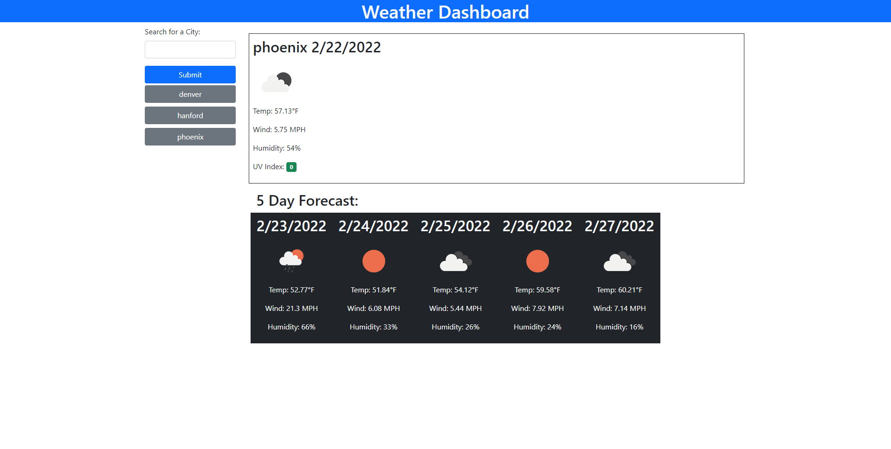

# WeatherApp

## Description

This code is for a simple weather app. The app takes the user input and uses the openweather api to get current weather and a 5 day forecast for the users city of choice. Current Weather and forecast are placed on the page dynamically. The users search is saved to local storage and can be accessed again via a dynamically placed button with the city name on it. The styling is all done with bootstrap.

## Table of Contents

- [License](#license)
- [Installation](#installation)
- [Usage](#usage)
- [Contributing](#contributing)
- [Tests](#tests)
- [Questions](#questions)

## License

This project is licensed under MIT. For more information please see [the liscense page](https://choosealicense.com/licenses/mit/)

## Installation

To install necessary dependencies, run the following command: npm i

## Usage

Screenshot of deployed app can be seen below:

Visit site [here](https://bhodge166.github.io/WeatherApp/)

## Contributing

If you would like to contribute please email me at the address below

## Tests

To run tests, run the following command: npm test

## Questions

Please reach out with any questions at:  
GitHub: [bhodge166](https://github.com/bhodge166) 
Email: bhodge166@gmail.com
